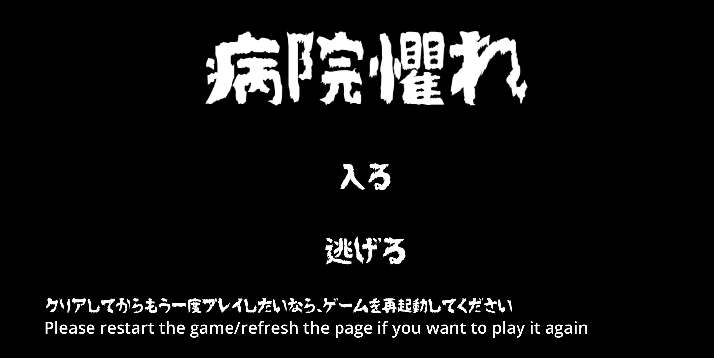
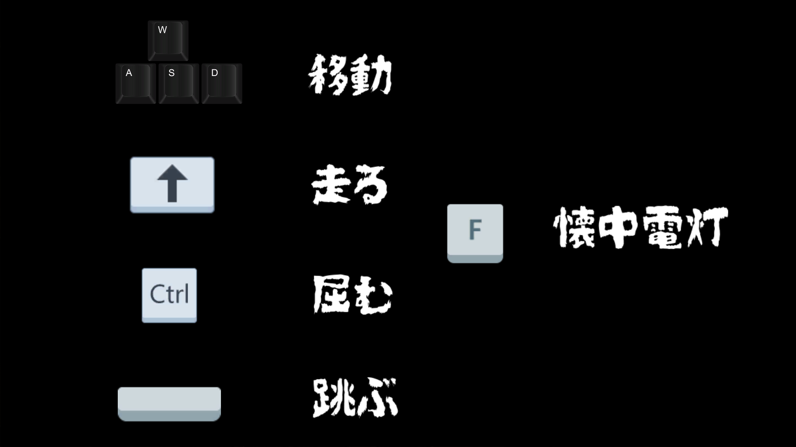
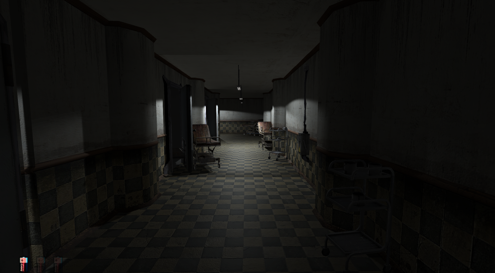
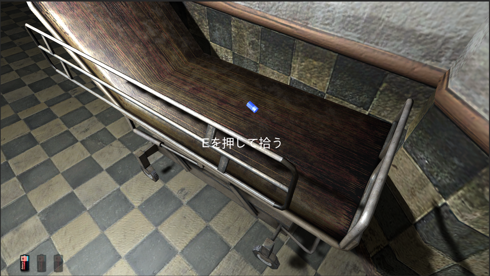
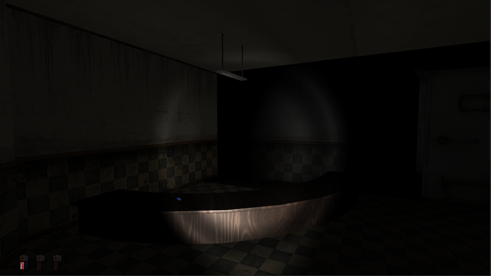

### Byoinosore(Hospital Horror)

#### Title

#### Introduction

This is a horror game made with Unity 2021.1.16f1. 
You are about to start a journey in an old hospital. There is no one there but you and... 

The game is in Japanese. The Japanese font looks so cool I really like the design. By the way, it is called "Japanese-Zomzi". I generated all text [here](https://fontmeme.com/japanese/)

#### How to Play

WASD----Move 
hold SHIFT----Run 
Ctrl----Crouch 
Space----Jump 
F----Flash light 

#### Screenshots

#### Credits(in alphabetical order)

[Easy Loading Screen by Tersein Game](https://assetstore.unity.com/packages/tools/gui/easy-loading-screen-140365)

[Ghoul-zombie by Dmitriy Dryzhak](https://assetstore.unity.com/packages/3d/characters/ghoul-zombie-114531)

[Horror Elements by Dmitriy Dryzhak](https://assetstore.unity.com/packages/audio/sound-fx/horror-elements-112021)

[Horror Sfx by Little Robot Sound Factory](https://assetstore.unity.com/packages/audio/sound-fx/horror-sfx-32834)

[Hospital Horror Pack by FoeJofMay](https://assetstore.unity.com/packages/3d/environments/hospital-horror-pack-44045)

[Hospital Medical Office Modular by Brick Project Studio](https://assetstore.unity.com/packages/3d/environments/hospital-medical-office-modular-165327)

[Key and Lock by CG Cell](https://assetstore.unity.com/packages/3d/props/furniture/key-and-lock-193317)

[Standard Assets (for Unity 2018.4) by Unity Technologies Inc.](https://assetstore.unity.com/packages/essentials/asset-packs/standard-assets-for-unity-2018-4-32351)

[True Horror - Crawler by Witch-A-Twin Studios](https://assetstore.unity.com/packages/3d/true-horror-crawler-70609)
